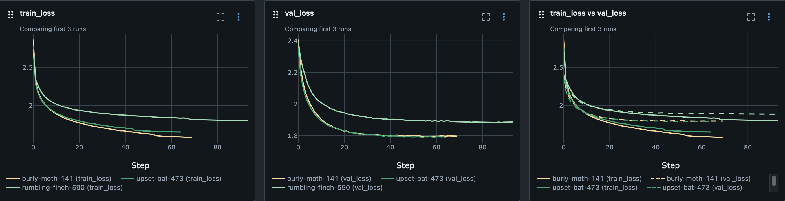

# Character-based Text Generation with PyTorch

## Table of Contents
* [Overview](#Overview)
* [Key Features](#Key--Features)
* [Data](#Data)
* [Development](#Development)
* [Execute](#Execute)
* [Experiment Tracking](#Experiment--Tracking)
* [References](#References)

## Overview 🔍
A Python project with PyTorch for generating surnames from various nationalities.
Implements 2 high-level processes:
- Training of character-based text generation PyTorch models
- New surnames generation with a pre-trained model

Both processes are fully configurable through dedicated configuration files. For
instance, for the training process, users can define training hyperparameters, such
as number of epochs, batch size, model/optimizer settings, in a YAML file. This allows for
easy customization and experimentation with different configurations without modifying
the source code.

Currently, the project supports three character-based text generation models, i.e.,
``simple_rnn_generator``, ``gru_generator``, ``lstm_generator``, but by leveraging the
benefits of the Factory Design Pattern for selection and initialization of different
models, the project can be easily extended to support more architectures.

Additionally, all the implemented models have 2 modes, i.e., unconditioned generation
(predict characters to form random surnames), and conditioned generation (predict characters
to form surnames biased towards a specific nationality).

The project also supports running multiple training experiments using different models
and/or  other hyperparameters. While the framework can handle hyperparameter tuning, its
primary objective is to define optimal hyperparameters for different models, facilitating
comparison of these models  on the same data.

### Project Structure 🌲
```
surnames-generator
├── .gitignore
├── .pre-commit-config.yaml     | Pre-commit hooks
├── Makefile                    | Development commands for code formatting, linting, etc
├── Pipfile                     | Project's dependencies and their versions using pipenv format
├── Pipfile.lock                | Auto-generated file that locks the dependencies to specific versions for reproducibility
├── README.md
├── checkpoints                 | Checkpoints directory.
├── colours.mk                  | A Makefile fragment containing color codes for terminal output styling
├── configs
│   ├── evaluation.yaml   | Configuration parameters for the generation of new surnames process
│   ├── logging.ini       | Configuration file for Python's logging module
│   └── experiments.yaml  | Configuration parameters for the training process. May contains multiple training experiments
├── docs                        | Sphinx generated documentation
│   ├──build
│   ├──source
│   └── ...
├── mlruns                      | MLFlow experiment tracking directory
│   └── ...
├── mypy.ini                    | Configuration file for the MyPy static type checker
└── surnames_generator          | The main Python package containing the project's source code
    ├── __about__.py            | Metadata about the project, i.e., version number, author information, etc
    ├── __init__.py
    ├── __main__.py             | The entry point for running the package as a script. Calls one of the controllers
    ├── controllers.py          | Contains the training and the generation controller.
    ├── datasets.py
    ├── engine
    │   ├── __init__.py
    │   ├── generator.py  | Contains the new surnames generation process
    │   ├── trainer.py    | Contains the training process
    │   └── utils.py      | Auxilliary functions/classes for the training process such as EarlyStopping
    ├── factories
    │   ├── __init__.py
    │   ├── client.py    | Interacts with the factories to return different instances of models, optimizers, and loss functions
    │   └── factories.py | Contains factory classes for creating different models, optimizers, and loss functions
    ├── models.py              | Contains the `simple_rnn_generator`, `gru_generator`, and `lstm_generator` models
    └── utils
        ├── __init__.py
        ├── aux.py             | Auxilliary functions/classes used across the project
        ├── vectorizers.py     | Vectorizes text sequences to numbers. Character-based vectorization.
        └── vocabulary.py      | Maps tokens to indices and vice versa
```

## Key Features 🔑
* **Customizable Experiments**: Define multiple experiments easily by configuring model
architecture, optimizer, learning rate, batch size, and other hyperparameters in a YAML
configuration file
* **Customizable Models**: Easily integrate new character-based text generation PyTorch
models, allowing for seamless experimentation with novel architectures and configurations
* **Experiment Tracking**: Utilize MLFlow for tracking training process
* **Checkpointing**: Ensure training progress is saved with checkpointing functionality,
allowing for easy resumption of training from the last saved state
* **EarlyStopping**: Automatically stop training when the model's performance stops
improving on a validation set
* **LRReduction**: Reduce learning rate during training facilitating better model performance

## Data 📄
The surnames dataset can be found [here](https://download.pytorch.org/tutorial/data.zip).
It consists of ~20000 surnames from 18 different nationalities.

Similar datasets can also be incorporated for character-based text generation.

The project expects the input data to be in CSV format.

## Development 🐍
Clone the repository:
  ```bash
  $ git clone https://github.com/KonstantinosKanaris/surnames-generator.git
  ```

### Set up the environment

#### Create environment
Python 3.10 is required.

- Create the environment and install the dependencies:
    ```bash
    $ pipenv --python 3.10
    $ pipenv install --dev
    ```
- Enable the newly-created virtual environment, with:
    ```bash
    $ pipenv shell
    ```
## Execute 🚀

### Training
>Define training experiment hyperparameters in the configuration file
>and from the project's root directory execute:
>```bash
>$ python -m surnames_generator train --config ./configs/experiments.yaml
>```
>To resume training for a specific model from a saved checkpoint execute:
>```bash
>$ python -m surnames_generator train --config ./configs/experiments.yaml --resume_from_checkpoint yes
>```
>The checkpoint directory path is defined in the configuration file.

### New Surnames Generation
>From the project's root directory execute:
>```bash
>$ python -m surnames_generator generate --config ./configs/evaluation.yaml
>```

*Successful conditioned surnames generation example - 3 samples per nationality*
>```commandline
>2024-03-20 02:00:35,354:  INFO      Samples for English:
>2024-03-20 02:00:35,376:  INFO      	- Coson
>2024-03-20 02:00:35,376:  INFO      	- Albey
>2024-03-20 02:00:35,376:  INFO      	- Neabend
>2024-03-20 02:00:35,376:  INFO      Samples for Russian:
>2024-03-20 02:00:35,378:  INFO      	- Vasiev
>2024-03-20 02:00:35,378:  INFO      	- Dermin
>2024-03-20 02:00:35,378:  INFO      	- Peenih
>2024-03-20 02:00:35,378:  INFO      Samples for Japanese:
>2024-03-20 02:00:35,379:  INFO      	- Ade
>2024-03-20 02:00:35,379:  INFO      	- Toshito
>2024-03-20 02:00:35,379:  INFO      	- Shigimoto
>...
>```

*Successful unconditioned (random) surnames generation example - 10 samples*
```commandline
>2024-03-20 02:11:17,921:  INFO      Goniols
>2024-03-20 02:11:17,921:  INFO      Males
>2024-03-20 02:11:17,921:  INFO      Zomosi
>2024-03-20 02:11:17,921:  INFO      Dikummase
>2024-03-20 02:11:17,921:  INFO      Alfein
>2024-03-20 02:11:17,921:  INFO      Yang
>2024-03-20 02:11:17,921:  INFO      Marko
>2024-03-20 02:11:17,921:  INFO      Rosem
>2024-03-20 02:11:17,921:  INFO      Gerbour
>2024-03-20 02:11:17,921:  INFO      Likart
```

## Experiment Tracking 📉
>Track your experiments with MLFlow by executing:
>```bash
>$ mlflow ui
>```

# &nbsp;&nbsp;&nbsp;


## References 📚
1. [Perkins, Jacob. *Natural Language Processing*. O'Reilly Media, 2017.](https://www.oreilly.com/library/view/natural-language-processing/9781491978221/)
2. [Robertson, Sean. "Generating Names with a Character-Level RNN." PyTorch Tutorials, PyTorch, Accessed March 18, 2024.](https://pytorch.org/tutorials/intermediate/char_rnn_generation_tutorial.html)
